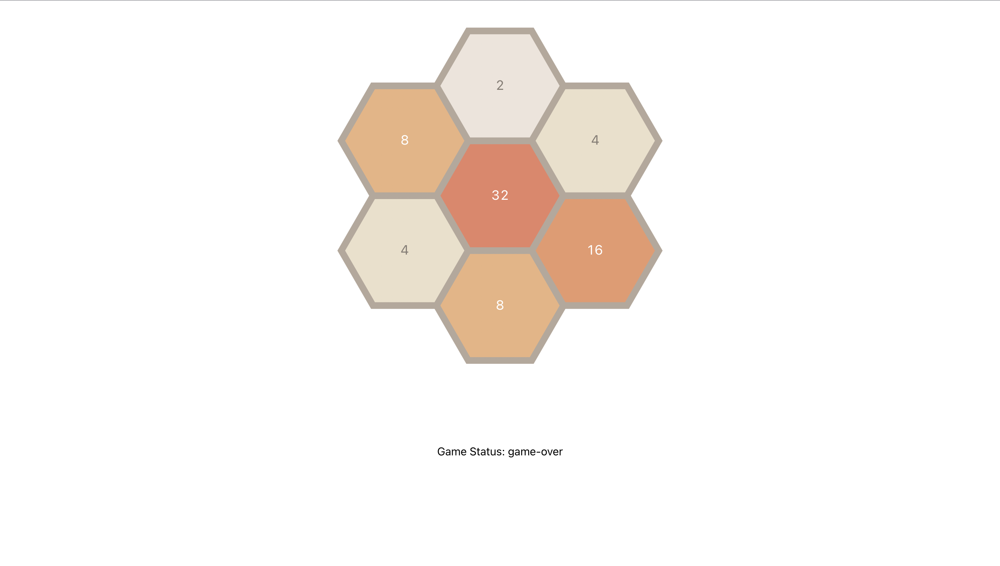

# Hegaxonal 2048 game

## Description

Classic 2048 game but on a hegaxonal grid, before entering game mode you can choose radius of the field and then game goes on.

## Functionality 
In game you can move tiles in 6 directions using following keys: "Q"-Nort-west, "W"-North, "E"-North-east, "A"-South-west, "S"-South, "D"- South-east.

Two tiles with same values get sumed up, after every movement tiles configuration is sent to the backend via POST method, which sents back one or more new values and cordinates for a new tiles. Goal is to reach 2048, but it doesn't stop there it continues infinitely, until all the tiles are full and there is no move left, then it's gameover.

## Project Screen-shots

## Installation:

`npm install`  

To Start Server:

`npm start`  

To Visit App:

`localhost:3000/`  

## Reflection 

This Project was writen from the scratch using create-react-app, as it uses simple API, no backend repository is needed it is connected with http. At first look game looks easy, but deep down it was good project for practicing communication with backend, work with side effects and promises.

For hex-grid react-hexgrid repo is used. For state manegement context is used, for routing - react-router-dom v6. 

